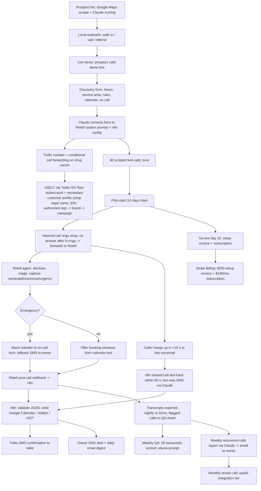

# Automation stack: AI front desk for home-service shops

The delivery machine behind [[reports/ai-front-desk-home-services/report]]; the execution sequence is in [[reports/ai-front-desk-home-services/plan]]. Evidence base: [[research/candidates/ai-front-desk-home-services]], [[research/candidates/ai-front-desk-home-services-skeptic-execution]], [[decisions/final-selection]].

## TL;DR

- **Stack: Retell (voice agent) + Twilio (number, SMS, 10DLC) + n8n self-hosted (intake, booking, alerts, reports) + Claude (prompt drafting, post-call summaries, weekly report) + Stripe Billing.** Retell over Vapi on reliability (Trustpilot 4.9 vs 2.4; Vapi 63 incidents/90 days and a 14-day transcript purge per the execution skeptic).
- **Delivery is 85-90% machine; the whole business is 45-55% automated by time** because sales, onboarding, transcript QA and platform babysitting (3-6 h/shop/mo) stay manual. Do not plan on "set and forget."
- Per-shop run cost ~$30-45/mo all-in incl. Stripe fees (~$20-35 before payment fees: 110 billable Retell minutes at $0.11-0.15 + number + 10DLC + SMS); fixed stack ~$50/mo; the first demo line costs ~$5-25 in month 1 (Retell-provisioned number, or an upgraded Twilio account; a Twilio trial account cannot take prospect calls).
- Month 1 runs by hand (one agent, manual calendar entry from the post-call email); months 2-3 automate the two things that matter: **A1 post-call webhook -> n8n intake -> calendar/CRM write + owner SMS**, and **A2 missed-call text-back with two-way SMS**, both specced below with failure handling.
- Six copy-paste prompts included: the Retell system prompt for a plumbing receptionist, the post-call extraction schema, the owner alert composer, the weekly recovered-calls report, the 40-scenario test-call generator, and the onboarding-form-to-prompt converter.
- QA gates that decide churn: greeting disclosure and recording consent in every state, no prices or safety advice beyond the owner's script, address read-back, and a weekly 20-transcript review with an intake-accuracy score (kill at <80%).
- Metrics logged per shop in one Google Sheet via n8n: calls, answered-by-AI, hang-ups <10 s, spam, messages captured, bookings written, text-backs sent/replied, intake accuracy, billable minutes, cost, MRR, churn events.

## 1. End-to-end workflow



## 2. Step table

Automation level: full = machine end to end; assisted = machine drafts, human approves; manual = human. Costs are 2026 list prices via third-party pages (vendor pages egress-blocked this session; see Sources). Times are per unit [E = operator estimate].

| # | Step | Who/what | Level | Tool + monthly cost | Time per unit | Quality gate |
|---|---|---|---|---|---|---|
| 1 | Build prospect list (1-5 trucks, no suite, slow review replies) | n8n + Google Maps/Apify + Claude scoring | assisted | Apify free tier / $0-20; Claude Pro $20 (shared) | 2 h per 100 shops | Phone verified; suite use checked on website |
| 2 | Local outreach | operator | manual | Claude drafts scripts ($0 extra) | 30 touches ~4 h/wk | Reply logged same day |
| 3 | Live demo | Retell demo agent | assisted | ~$10/mo demo minutes | 5 min | Latency <1.5 s; disclosure heard |
| 4 | Discovery | operator + Google Form | manual | $0 | 40 min | All 18 fields filled (form below) |
| 5 | Agent build from template | Claude drafts prompt; operator edits in Retell | assisted | Retell $0 until minutes used | 2 h first, 45 min templated | No invented prices; escalation rules match form |
| 6 | Telephony | operator | manual | Twilio number ~$1.15/mo or Retell number $2/mo | 45 min + carrier call | Forwarding tested from a cell |
| 7 | 10DLC per shop via Twilio ISV flow: subaccount + secondary customer profile (legal name as on IRS records, EIN, address, website, authorized representative) -> Low-Volume Standard brand -> campaign; requires your own primary profile set to "ISV Reseller or Partner" and approved first (Twilio ISV docs, 2026) | operator | manual | $4.50 brand + $15 vetting one-time; $1.50-10/mo campaign | 45 min + approval wait | Terms and privacy URLs live before submit (required since 2026-06-30); message-flow field describes the consumer-initiated text-back verbatim (error 30909 otherwise) |
| 8 | Test calls (40 scenarios) | Claude generates; operator calls | assisted | ~$5 Retell minutes | 1.5 h | >=90% correct intake on scripted calls |
| 9 | Pilot start (day 1) + owner walkthrough; go-live = day 15 auto-conversion | operator, Loom | manual | Loom free | 30 min | Owner receives and reads first alert |
| 10 | Answer calls 24/7 | Retell | full | ~110 billable min x $0.11-0.15 = $12-17/shop | 0 | Disclosure in first sentence; address read-back |
| 11 | Book to calendar/CRM | n8n (A1) | full | n8n VPS $5-7/mo total | 0 | No double booking; timezone from shop config |
| 12 | Text-back and two-way SMS | n8n + Twilio + Claude API (A2) | full | Twilio SMS ~$5/shop; Claude API pennies | 0 | Only after 10DLC approved; STOP honoured |
| 13 | Owner alert / warm transfer | Retell transfer + Twilio SMS | full | included | 0 | Transfer fallback fires within 30 s |
| 14 | Transcript export + flagging | n8n nightly | full | Google Drive free | 0 | Flag: hang-up, transfer fail, "human", "price", "gas" |
| 15 | Weekly QA review | operator + Claude scoring | assisted | Claude Pro | 45 min/shop/wk in month 1, 20 min after | Intake accuracy >=80% on real calls |
| 16 | Weekly recovered-calls report | n8n + Claude -> email | full (operator skims) | included | 5 min | Counts only agent-booked jobs |
| 17 | Billing (setup invoice + subscription raised together on go-live, day 15) | Stripe Billing | full | 2.9% + $0.30 + 0.7% (~$8 on $199) | 0 | Failed-card retry (Smart Retries included) |
| 18 | Support and platform babysitting | operator | manual | $0 | 3-6 h/shop/mo (skeptic) | Smoke test after any Retell changelog |

## 3. Recommended stacks by budget

| Tier | Tools (links) | Monthly | What it unlocks | What it lacks |
|---|---|---|---|---|
| **Free (demo and pilot #1)** | [Retell](https://www.retellai.com/pricing) $10 free credit (~60 min) then pay-as-you-go, with a Retell-provisioned number ($2/mo; no Twilio needed for a voice-only demo) **or** an upgraded [Twilio](https://www.twilio.com/en-us/phone-numbers/a2p-10dlc) account ($20 credit top-up, Lumentra relay 2026) + one number ~$1.15. A Twilio *trial* account plays a trial announcement on every call and only accepts inbound calls from up to 5 verified numbers ([Twilio trial limitations](https://support.twilio.com/hc/en-us/articles/360036052753-Twilio-Free-Trial-Limitations), 2026), so it cannot be the prospect-facing demo line or a pilot; [n8n self-hosted](https://expresstech.io/the-real-cost-of-self-hosting-n8n-in-2026/) on a free Oracle/Fly tier or a $5 VPS, or n8n Cloud trial for weeks 1-4; Google Calendar + Sheets; Claude Pro you already pay; Stripe (no fee until revenue) | ~$5-25 first month | A working demo line and one free pilot; post-call email you copy into a calendar by hand | No SMS until 10DLC ($19.50 one-time); no redundancy; you are the automation |
| **~$50/month (first 1-3 paying shops)** | Retell PAYG (~$15/shop); Twilio number + SMS; n8n on a $5-7 VPS (Hetzner/DigitalOcean); Claude Pro $20; Google Workspace free tier; Stripe Billing; Loom free; Apify free tier | ~$45-60 + ~$30-45 per shop incl. Stripe fees (rebilled) | A1 and A2 fully automated, nightly transcript export, weekly report, Stripe subscriptions | No second voice provider, no monitoring beyond n8n error emails |
| **~$150/month (5+ shops, asset mode)** | Everything above; [n8n Cloud Starter](https://www.nocode.mba/articles/n8n-pricing) EUR 20-24 if you want managed uptime, or keep the VPS and add UptimeRobot/BetterStack free; Claude API ~$5-10 for summaries; Retell knowledge base (+$0.005/min) and guardrails (+$0.005/min); ElevenLabs voice on Retell (+$0.04/min) for one premium shop; a [white-label wrapper](https://www.seldonframe.com/guides/voice-ai-reseller-programs) only if a client demands a branded portal ($99-299/mo, vendor list prices) | ~$120-160 + per-shop | Branded client portal, better voice, guardrails, managed n8n, uptime alerts | Still no human backup; still 3-6 h/shop/mo of QA and babysitting |

Do not buy: Vapi (reliability, execution skeptic), Synthflow white-label (~$30k/yr per Seldon Frame July 2026), paid outreach tools, ads.

## 4. Copy-paste prompts and templates

### 4.1 Retell system prompt: plumbing receptionist (fill the {{fields}} from the onboarding form)

```
You are "Sam", the AI phone assistant for {{shop_name}}, a residential plumbing company in {{city_state}}. You answer calls the team cannot pick up. You are warm, brief and practical. You never pretend to be human.

FIRST SENTENCE, ALWAYS, IN EVERY STATE:
"Thanks for calling {{shop_name}}, this is Sam, the AI assistant. This call may be recorded. How can I help?"
If the caller asks whether you are a person or a bot, say plainly that you are an AI assistant for {{shop_name}} and that a person will follow up.

YOUR JOB, IN ORDER:
1. Find out what is wrong. Ask one question at a time. Common issues: leak, clog or backup, no hot water, burst pipe, running toilet, sump pump, gas smell.
2. SAFETY FIRST. If the caller mentions a gas smell, carbon-monoxide alarm, sparking, or water touching electrical panels: say "Please leave the building now and call 911 or {{gas_utility_name}} at {{gas_utility_phone}}. I'll let {{owner_first_name}} know right away." Then end the call politely. Give no other safety advice.
3. Decide urgency using these rules from the owner:
   EMERGENCY (offer same-day/after-hours dispatch): {{emergency_rules}}  e.g. active leak that cannot be shut off, sewage backup, burst pipe, no water to the house.
   URGENT (next available slot): {{urgent_rules}}  e.g. no hot water, single clogged drain, toilet not flushing in a one-bathroom home.
   ROUTINE (book normally): everything else.
4. Capture, and read back to confirm: full name, callback mobile number, service address including city and ZIP, whether it is a house, apartment, or business, and a one-sentence description of the problem.
5. Service area: {{service_area_zips_or_radius}}. If the address is outside it, say you are sorry, you do not cover that area, and end the call. Do not refer to other companies.
6. BOOKING: call the tool get_availability with the urgency level. Offer at most two windows. When the caller picks one, call book_slot. Confirm: "You're booked for {{window}}. You'll get a text confirmation at this number."
   If it is an EMERGENCY and {{after_hours_transfer}} is "yes", say "Let me connect you with the on-call plumber" and call transfer_call to {{on_call_number}}. If the transfer fails, say "I couldn't reach them directly. I've sent your details to the team and someone will call you back within {{emergency_callback_minutes}} minutes," then call notify_owner.
7. PRICING: the only price you may state is the dispatch fee: "{{dispatch_fee_script}}". For anything else say: "The plumber will give you a price on site before any work starts." Never estimate repair costs.
8. If the caller wants to speak to a human during business hours ({{business_hours}}), call transfer_call to {{office_number}}. Outside those hours, take the message and say a person will call back {{callback_promise}}.
9. Existing customers, invoices, warranty questions, job applications, vendors and sales calls: take name, number and topic, say {{owner_first_name}} will call back, and end the call. Never take payment details.

STYLE:
- Short sentences. No jargon. One question per turn. Do not repeat the caller's whole sentence back.
- If you did not understand, ask them to repeat; never guess an address. Spell back street names.
- Do not say "as an AI". Do say "I'm the AI assistant" when asked.
- Close with: "Anything else I can note for the team? ... Thanks for calling {{shop_name}}."

NEVER: give prices beyond the dispatch fee, give safety advice beyond step 2, promise an exact arrival time, call anyone back yourself, discuss other companies, or continue a call that has become abusive (say "I'm going to end the call now, the team will follow up" and hang up).
```

Tool definitions the prompt expects (configure in Retell; each hits an n8n webhook): `get_availability(urgency)`, `book_slot(window_id, name, phone, address, issue, urgency)`, `transfer_call(number)`, `notify_owner(summary)`.

### 4.2 Post-call extraction (Retell post-call analysis or Claude on the transcript)

```
You are extracting structured data from a phone call transcript for a home-service company. Return ONLY valid JSON matching this schema, no commentary:

{
  "caller_name": string|null,
  "callback_phone": string|null,        // E.164 if possible
  "service_address": string|null,
  "property_type": "house"|"apartment"|"business"|null,
  "issue_summary": string,              // one sentence, plain English
  "trade_category": "leak"|"clog"|"no_hot_water"|"burst_pipe"|"toilet"|"sump"|"gas_smell"|"hvac_no_heat"|"hvac_no_cool"|"electrical"|"other",
  "urgency": "emergency"|"urgent"|"routine"|"not_a_service_call",
  "booking_made": boolean,
  "booking_window": string|null,
  "transfer_attempted": boolean,
  "transfer_succeeded": boolean|null,
  "caller_asked_if_bot": boolean,
  "disclosure_given_first_sentence": boolean,
  "price_stated_beyond_dispatch_fee": boolean,
  "safety_script_triggered": boolean,
  "outside_service_area": boolean,
  "call_type": "service_request"|"existing_customer"|"vendor_or_sales"|"spam"|"hangup"|"wrong_number"|"job_applicant",
  "intake_complete": boolean,           // true only if name, phone, address and issue were all captured and read back
  "needs_human_followup": boolean,
  "followup_reason": string|null,
  "qa_flags": string[]                  // any of: "guessed_address","no_readback","hallucinated_price","unsafe_advice","rude_caller","agent_loop","long_silence","transfer_failed"
}

Rules: if a field was not stated, use null, never invent. "intake_complete" requires a read-back in the transcript. Set "spam" for robocalls, IVR trees, or silence.
Transcript:
<<<{{transcript}}>>>
```

### 4.3 Owner alert composer (n8n -> Claude API -> Twilio SMS, max 300 characters)

```
Write a single SMS (max 300 characters, no emojis, no greeting) for a busy plumbing-company owner summarising this call record. Order: urgency tag in caps, issue, name, callback number, address, what was booked or what they need to do. If needs_human_followup is true, start with "CALL BACK:". If urgency is "emergency" and transfer_succeeded is false, start with "EMERGENCY, NOT TRANSFERRED:". Do not include anything the record does not contain.

Record: {{json}}
```

Example output: `EMERGENCY, NOT TRANSFERRED: sewage backup in basement. Dana Ruiz 512-555-0142, 1180 Elm St 78745 (house). Told 30-min callback. Not booked.`

### 4.4 Weekly recovered-calls report (n8n Sunday 18:00 -> Claude -> email)

```
You write a one-page weekly report for the owner of {{shop_name}} from the attached call log (CSV rows: timestamp, call_type, urgency, intake_complete, booking_made, booking_window, transfer_succeeded, duration_sec, text_back_sent, text_back_replied). Use plain language, no hype, no adjectives like "amazing".

Sections, in this order:
1. Headline: "This week Sam answered N calls you couldn't. X were service requests. Y were booked into your calendar. Z need a call back (listed below)."
2. Table: day | calls answered | service requests | booked | text-backs replied.
3. "Calls to return" list: name, number, issue, urgency (only rows with needs_human_followup = true and no booking).
4. One example of a call handled well: one or two sentences, real details from the log, no invented outcome.
5. "What we changed this week": {{changes_made}} (leave blank if none).
6. Footer: "Only jobs Sam booked are counted as booked. Estimated value is not shown unless you tell us your average ticket."

Never estimate revenue unless {{avg_ticket}} is provided; if it is, add one line: "If your average job is ${{avg_ticket}}, this week's Y bookings are worth about $Y x avg_ticket." Never count calls Sam transferred as bookings.
Log:
{{csv}}
```

### 4.5 Test-scenario generator (Claude Pro, before every go-live)

```
Generate 40 realistic inbound phone-call scenarios to test an AI receptionist for a residential {{trade}} company in {{city}}. Output a numbered list. Each item: (a) caller persona in one line (age, mood, accent or speech pattern, background noise), (b) the opening line they say, (c) the situation and any curveballs they will throw (interrupting, changing address mid-call, asking for a price, asking "are you a robot", refusing to give an address, asking for a competitor, speaking Spanish, bad signal), (d) the correct outcome: one of EMERGENCY-TRANSFER, EMERGENCY-CALLBACK, BOOK-URGENT, BOOK-ROUTINE, OUT-OF-AREA, MESSAGE-ONLY, SAFETY-SCRIPT, END-CALL.
Distribution: 8 emergency, 10 urgent, 10 routine, 4 out-of-area, 3 vendor/spam/wrong-number, 2 gas or CO safety, 3 existing-customer or invoice questions. Include at least 6 calls where the caller gives a street name that is easy to mishear.
```

Score each call on: disclosure first sentence (y/n), urgency correct (y/n), name/phone/address captured and read back (y/n each), booking or transfer correct (y/n), no price or safety violation (y/n). Go-live threshold: >=36/40 on urgency and booking, zero violations.

### 4.6 Onboarding-form-to-prompt converter (Claude Pro)

```
Below is a completed onboarding questionnaire for a {{trade}} company. Produce (1) the filled-in system prompt by substituting every {{field}} in the template that follows, (2) a JSON config for n8n with keys: shop_name, timezone, business_hours (per weekday), emergency_rules[], urgent_rules[], service_area (zips[] or radius_miles + center), dispatch_fee_script, on_call_number, office_number, owner_sms_number, calendar_id, booking_windows (weekday morning/afternoon/evening, weekend), after_hours_transfer (yes/no), emergency_callback_minutes, callback_promise, recording_allowed (yes/no by owner choice and state), and (3) a list of every field the questionnaire left blank or ambiguous that I must ask the owner before go-live. Do not invent values for blanks.
Questionnaire:
{{answers}}
Template:
{{template_prompt}}
```

## 5. QA checklist (quality and policy)

Before go-live, and re-run after any Retell changelog or prompt edit:

- [ ] Greeting discloses "AI assistant" and "may be recorded" in the first sentence; heard on a real cell call, not the web tester.
- [ ] Recording: treat as all-party CA, DE, FL, IL, MD, MA, MT, NV, NH, PA, WA (11 clear; Nevada is all-party for phone calls under NRS 200.620) plus CT, MI, OR, VT (mixed or unsettled; treat as all-party to be safe) per Recording Law, NextPhone and Viirtue 2026. When the caller may be in another state, the stricter law applies. Check questionnaire field 14 (states served). If the owner will not keep the disclosure, disable recording in Retell and rely on the transcript only.
- [ ] Agent answers "are you a robot?" truthfully and discloses AI in the first sentence (Utah SB 149: disclose if asked, regulated occupations proactively; Maine LD 1727 Chatbot Disclosure Act, in force 2025-09-24, covers voice callbots and requires disclosure at the start of the interaction; California B.O.T. Act unsettled for voice; Colorado AI Act delayed to 2027-01-01 by SB 189, signed 2026-05-14, not yet in force). The first-sentence disclosure satisfies all of them.
- [ ] No outbound calls of any kind from the agent; the "callback" is a human or the single A2 text-back. SMS counts as a call under the TCPA and consent for calls does not automatically extend to texts (Wipfli, ActiveProspect 2026), so the text-back is one informational message to a consumer-initiated inbound contact, never marketing, with shop name and STOP, rate-limited to 1 per number per 24 h, with the inbound call logged as the consent event and this exact flow written into the 10DLC campaign message-flow field (Twilio error 30909 if omitted). Log any caller callback request verbatim (FCC 24-17 treats AI voices as artificial; TCPA prior express consent needed for any outbound AI-voice call).
- [ ] No prices beyond the dispatch-fee script; no safety advice beyond the gas/CO script; scored 0 violations on 40 scripted calls.
- [ ] Address read-back on 100% of booked calls; a mis-heard address is the fastest churn path.
- [ ] Transfer fallback tested with the on-call phone switched off: owner SMS arrives within 30 s.
- [ ] 10DLC: shop website has a privacy policy stating mobile information is not shared with third parties for marketing, and a terms page with opt-in/opt-out language; TermsAndConditionsUrl submitted (required since 2026-06-30); SMS disabled in n8n until campaign status is approved.
- [ ] SMS body includes shop name and "Reply STOP to opt out" on the first message; STOP handled by Twilio and mirrored in the n8n contact sheet.
- [ ] Owner alert tested to the owner's actual cell; daily digest email lands in inbox not spam.
- [ ] Weekly report counts only agent-booked jobs; no vendor case-study numbers, no estimated revenue without the owner's own average ticket (FTC endorsement/testimonial rule).
- [ ] Transcript export runs nightly to the shop's Drive folder (contract: transcripts belong to the shop).
- [ ] Service agreement signed with: AI-may-err clause, limitation of liability, 30-day cancellation, data ownership, no outbound marketing clause.
- [ ] Post-go-live: week-1 daily transcript skim; week-2+ 20-transcript weekly sample scored on the 4.2 schema; intake accuracy >=80% or escalate.

## 6. Automation roadmap

**Month 1 (by hand):** one Retell agent per pilot shop; post-call email from Retell read by the operator, who enters the booking in the shop's Google Calendar and texts the owner manually; test calls scored in a sheet; Stripe invoice sent by hand. This proves the call flow before any pipe is built and keeps the first pilot cost near $0.

**Months 2-3 (automate):** A1 then A2 below, then the nightly transcript export, then the weekly report, then Stripe Billing subscriptions with the setup fee as a one-time invoice item. Everything in n8n, self-hosted, with a Claude API key for summaries.

### A1. Post-call intake -> booking -> alerts (n8n)

- **Trigger:** Retell `call_analyzed` webhook (POST) to `https://{{n8n_host}}/webhook/retell-postcall` with a shared secret header. Also polled hourly as a safety net via Retell list-calls API for the last 2 hours to catch missed webhooks.
- **Inputs:** call_id, from/to numbers, transcript, Retell post-call analysis fields (or run prompt 4.2 via Claude API if analysis is missing), shop config (looked up by the `to` number in a Google Sheet or n8n data table).
- **Steps:** (1) verify secret and dedupe on call_id; (2) parse/validate JSON against the 4.2 schema (n8n Code node with a JSON-schema check); (3) if `call_type` is spam/hangup/wrong_number, log and stop; (4) if `booking_made` and no `booking_window` conflict, write the event to the shop's calendar (Google Calendar node) or CRM (Jobber/HCP HTTP node) with name, phone, address, issue in the description; (5) send the caller a Twilio SMS confirmation (only if 10DLC approved flag is true, otherwise skip); (6) compose the owner SMS with prompt 4.3 and send; (7) append the row to the shop's call-log sheet; (8) if any `qa_flags` or `needs_human_followup`, append to the QA sheet and email the operator.
- **Outputs:** calendar/CRM event id, SMS message SIDs, log row, QA row.
- **Failure handling:** every external call wrapped in n8n error workflow; on calendar write failure retry 3x with backoff, then SMS the owner "booking not written, call back {{name}} {{phone}}" and email the operator; on Claude API failure fall back to a template SMS built from raw fields; on duplicate call_id, exit; all failures logged to an "incidents" sheet with timestamp and shop.

### A2. Missed-call text-back and two-way SMS

- **Trigger:** Twilio call-status webhook (`no-answer`, `busy`, or completed with duration < 10 s on the forwarded leg) OR Retell `call_ended` with `disconnection_reason` indicating caller hang-up before intake. Fires only if the shop's 10DLC campaign status is approved and the number is not on the STOP list.
- **Inputs:** caller number, shop config, time of day, most recent log row for that number (to avoid texting twice within 24 h).
- **Steps:** (1) within 60 s send: "Hi, this is {{shop_name}}. Sorry we missed you. Reply with your address and what's going on and we'll get you scheduled, or call back anytime. Reply STOP to opt out."; (2) Twilio inbound-SMS webhook -> n8n; (3) Claude API with a strict system prompt (collect name, address, issue, preferred window; never quote prices; escalate on emergency keywords by SMS-alerting the owner immediately); (4) when the four fields are complete, call the same booking sub-workflow as A1 step 4-6; (5) log every message to the sheet; (6) stop the thread after 6 turns or 24 h and hand to the owner.
- **Outputs:** SMS thread, booking or owner-followup row.
- **Failure handling:** if Twilio returns 30xxx delivery errors, mark number undeliverable and notify owner by the daily digest; if Claude output fails schema validation, send a fixed fallback message asking for address and issue; rate-limit to 1 text-back per number per 24 h; STOP/HELP handled by Twilio Advanced Opt-Out and mirrored to the sheet.
- **Compliance note (weakest point in the stack):** texts are "calls" under the TCPA and consent for a call does not automatically cover a text. A2 is defensible only as one *informational* message to a *consumer-initiated* contact: the caller dialled the shop, the message only offers to schedule the service they called about, it carries the shop name and STOP, and it is never re-sent or used for promotions. Log the inbound call (caller number, timestamp, shop number) as the consent event, and describe this flow verbatim in the 10DLC campaign's message-flow/CTA field, since carriers reject campaigns whose consent path is unclear (Twilio error 30909). Sources: Wipfli 2026, ActiveProspect 2026, Twilio error docs.

**Months 4-6 (only after 3 paying shops):** platform smoke test workflow (5 scripted calls fired via Retell API after each changelog, results emailed); monthly review-call deck auto-drafted; churn-risk flag (calls answered down 40% month-over-month, owner not opening reports).

## 7. Metrics to log and how

One Google Sheet per shop plus a master sheet, all written by n8n; a Looker Studio or simple Sheet dashboard reads them.

| Metric | Definition | Source | Cadence |
|---|---|---|---|
| Calls forwarded | calls reaching Retell | Retell webhook | per call |
| Hang-ups <10 s | caller ended before intake (operator log: ~37% in one dataset) | Retell disconnection reason | per call |
| Spam | call_type = spam (~9% benchmark) | prompt 4.2 | per call |
| Service requests | call_type = service_request | prompt 4.2 | per call |
| Intake complete | name+phone+address+issue read back | prompt 4.2 | per call |
| Bookings written | calendar/CRM event created | A1 | per call |
| Transfers attempted / succeeded | | Retell | per call |
| Text-backs sent / replied / booked | | A2 | per event |
| Intake accuracy | weekly 20-transcript human score vs prompt 4.2 | QA sheet | weekly |
| Billable minutes and platform cost | Retell usage export | Retell API | daily |
| MRR, setups, churn events, pause requests | Stripe | Stripe webhook -> n8n | on event |
| Outreach: touches, replies, demos, pilots, closes | operator log | manual sheet | daily |
| Babysitting hours per shop | operator timer | manual | weekly |

Thresholds that trigger action: intake accuracy <80% (retune or kill), hang-ups >45% (change voice/greeting), bookings/service-request <50% (check availability tool), owner report opens = 0 for 2 weeks (call the owner; churn risk).

## Sources

- [Cekura: Retell AI pricing per minute 2026 ($0.07 engine; $0.13-0.31 all-in)](https://www.cekura.ai/blogs/retell-ai-pricing-per-minute)
- [CloudTalk: Retell AI pricing 2026](https://www.cloudtalk.io/retell-ai-pricing/)
- [CloudTalk: Retell AI vs Vapi AI 2026 (ratings)](https://www.cloudtalk.io/retell-ai-vs-vapi-ai/)
- [CloudTalk: Vapi AI plans and pricing 2026 ($0.05/min, 10 concurrent lines)](https://www.cloudtalk.io/blog/vapi-ai-pricing/)
- [Lumentra CallAgent: Vapi gotchas and limitations 2026 (incidents, retention, breaking changes)](https://github.com/Lumentra-AI/CallAgent/blob/4bc844ab50f428e1f5cd5105745394cfde862c85/docs/research/vapi-gotchas-limitations-2026.md)
- [Lumentra CallAgent: Vapi call-transfer capabilities 2026](https://github.com/Lumentra-AI/CallAgent/blob/4bc844ab50f428e1f5cd5105745394cfde862c85/docs/research/vapi-call-transfer-capabilities-2026.md)
- [StatusGator: Retell AI status history (egress-blocked, unverified 2026-09-11)](https://statusgator.com/services/retell-ai)
- [Retell AI docs: Reliability overview](https://docs.retellai.com/reliability/reliability-overview)
- [Retell AI community: AI receptionist for a plumbing company with SMS confirmation (Retell + n8n)](https://community.retellai.com/t/i-built-an-ai-receptionist-for-a-plumbing-company-send-sms-confirmation-retell-n8n/3137)
- [YouTube: I built an AI receptionist for a plumbing company (Retell AI)](https://www.youtube.com/watch?v=-CVQa_Su878)
- [Achiya Cohen: AI phone-agent cost analysis, 774 calls, Aug-Sep 2026 (hang-ups, spam, rounding)](https://github.com/achiya-automation/safari-mcp/blob/29af3b9f87f6cc85e11d35766898ef78aa4abdc1/ai-call-cost-il-2026-09-10.html)
- [No Code MBA: n8n pricing 2026](https://www.nocode.mba/articles/n8n-pricing)
- [ExpressTech: Real cost of self-hosting n8n in 2026](https://expresstech.io/the-real-cost-of-self-hosting-n8n-in-2026/)
- [Twilio: A2P 10DLC overview](https://www.twilio.com/en-us/phone-numbers/a2p-10dlc)
- [Twilio Help: Sole Proprietor vs Low Volume Standard vs Standard registration](https://help.twilio.com/articles/4407882914971-Comparison-between-Starter-Low-Volume-Standard-and-Standard-registration-for-A2P-10DLC)
- [Twilio Help: A2P 10DLC campaign vetting FAQ](https://help.twilio.com/articles/11587910480155-A2P-10DLC-Campaign-Vetting-FAQ)
- [Twilio error 30934: Terms and Conditions URL required (2026-06-30)](https://www.twilio.com/docs/api/errors/30934)
- [Twilio error 30908: compliant privacy policy required](https://www.twilio.com/docs/api/errors/30908)
- [Twilio error 30882: Terms and Conditions content rejected](https://www.twilio.com/docs/api/errors/30882)
- [Twilio error 30909: Campaign rejected, message flow or call to action incomplete (2026)](https://www.twilio.com/docs/api/errors/30909)
- [Twilio docs: ISV A2P 10DLC onboarding overview (2026)](https://www.twilio.com/docs/messaging/compliance/a2p-10dlc/onboarding-isv)
- [Twilio docs: A2P 10DLC, gather the required business information (2026)](https://www.twilio.com/docs/messaging/compliance/a2p-10dlc/collect-business-info)
- [Twilio Help: Free trial account restrictions and limitations (2026)](https://support.twilio.com/hc/en-us/articles/360036052753-Twilio-Free-Trial-Limitations)
- [Nordbastion: Self-host n8n on a VPS with Docker, Postgres, Caddy (2026)](https://nordbastion.com/guides/self-host-n8n-on-a-vps/)
- [Sociocs: Twilio 10DLC registration and pricing explained](https://www.sociocs.com/post/twilio-10dlc-explained/)
- [Checkout Page: Stripe fees explained 2026](https://checkoutpage.com/blog/stripe-processing-fees)
- [Seldon Frame: Voice AI reseller programs (white-label prices, July 2026)](https://www.seldonframe.com/guides/voice-ai-reseller-programs)
- [Retell AI: How the certified partner program works](https://www.retellai.com/blog/how-retell-ais-certified-partners-work)
- [Sembly AI: Call recording laws 2026, one-party vs two-party](https://www.sembly.ai/blog/call-recording-laws-one-party-vs-two-party-consent/)
- [Viirtue: Call recording consent laws by state 2026 (via reviewer; egress-blocked 2026-09-11)](https://viirtue.com/call-recording-consent-laws-by-state-2026-guide/)
- [Recording Law: Nevada recording laws 2026 (NRS 200.620, all-party for phone calls)](https://www.recordinglaw.com/united-states-recording-laws/one-party-consent-states/nevada-recording-laws/)
- [NextPhone: Call recording laws by state 2026](https://www.getnextphone.com/blog/call-recording-laws-by-state)
- [Verrill: Maine LD 1727 chatbot disclosure law (2025)](https://www.verrill-law.com/news/maine-law-now-requires-limited-disclosures-of-artificial-intelligence-technology/)
- [Hunton: Colorado AI Act amended and delayed to 2027-01-01 (May 2026)](https://www.hunton.com/privacy-and-cybersecurity-law-blog/colorado-ai-act-amended-and-effective-date-delayed)
- [Wipfli: TCPA informational text messages, rules and requirements (2026)](https://www.wipfli.com/insights/articles/tcpa-informational-text-messages-rules-and-requirements)
- [ActiveProspect: TCPA text messages guide 2026](https://activeprospect.com/blog/tcpa-text-messages/)
- [JustCall: AI voice agent disclosure laws 2026](https://justcall.io/blog/ai-voice-agent-disclosure-laws.html)
- [Thoughtly: AI disclosure requirements for voice agents](https://thoughtly.com/blog/ai-disclosure-requirements-what-to-tell-callers)
- [FCC Declaratory Ruling FCC 24-17 (PDF)](https://docs.fcc.gov/public/attachments/FCC-24-17A1.pdf)
- [VoiceAI Connect: Monthly reporting template for AI receptionist agencies 2026 (vendor)](https://www.myvoiceaiconnect.com/blog/monthly-reporting-template-ai-receptionist-agency)
- Vault: [Candidate dossier](../../research/candidates/ai-front-desk-home-services.md) · [Execution skeptic](../../research/candidates/ai-front-desk-home-services-skeptic-execution.md) · [Final selection](../../decisions/final-selection.md)
