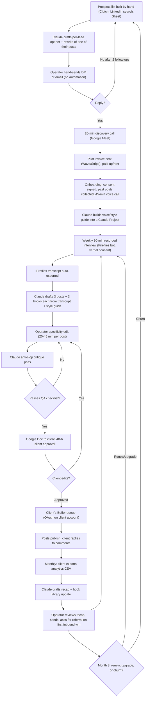

# Automation stack: LinkedIn founder ghostwriting

Blueprint for the delivery machine behind [[reports/linkedin-founder-ghostwriting/report]]; the execution sequence is in [[reports/linkedin-founder-ghostwriting/plan]]. Research basis: [[research/candidates/linkedin-founder-ghostwriting]] (automation map) as corrected by [[research/candidates/linkedin-founder-ghostwriting-skeptic-execution]]; selection context in [[decisions/final-selection]].

## TL;DR

- Design rule: **the human edit is the product.** AI does transcription, style-guide extraction, first drafts, hook variants, carousel copy, scheduling and the analytics recap; the operator does the interview, the specificity edit, the client relationship and every outreach message. Time-weighted automation is 45-50% in months 1-3 and ~55% at steady state (skeptic-corrected from the dossier's 58%); do not try to push it higher, because LinkedIn now cuts views ~40% on content it classifies as AI slop and notifies the poster.
- Per client per month at steady state: ~10-12 operator hours; months 1-3: 13-16 hours (onboarding 4-8 h, heavier revisions). Nothing in the stack can shorten the 30-minute call; everything else can be trimmed.
- Three tiers: **Free ($0)** = Claude free + Zoom local recording + Fireflies free uploads (delete after export) + Canva free + Buffer free + Wave; **~$50/mo** = Claude Pro $20 + Fireflies Pro $18 + Canva Pro $12 (annual) + Buffer free; **~$150/mo** = the $50 stack on monthly billing plus Taplio Growth $69 and n8n Cloud Starter $24. The $50 tier is the one to run; $150 only pays at 3+ clients.
- Six copy-paste prompts below cover the core AI steps: voice guide, interview questions, transcript-to-posts, anti-slop critique, carousel copy, monthly recap. Every prompt forbids invented specifics and outputs a "needs a real number here" placeholder rather than a plausible-sounding fake.
- Month 1 is all by hand (Claude Project + Google Docs + Fireflies). Months 2-3 automate two things: (A) transcript -> draft doc pipeline (Fireflies webhook -> n8n -> Claude API -> Google Doc -> email), (B) monthly analytics recap from a client-exported CSV. Both have specs below with failure handling.
- Hard limits: hand-send all outreach (LinkedIn User Agreement 8.2 bars bots and automated messaging); client connects their own LinkedIn to Buffer via OAuth; never hold a client's password; no auto-comments, no engagement pods; announce recording at the top of every call and keep written consent on file (Otter and Fireflies are both in wiretap/BIPA litigation).
- Log eight metrics weekly in one Google Sheet: messages sent, replies, calls, pilots, posts shipped, posts flagged, edit minutes per post, inbound wins reported by the client.

## 1. End-to-end workflow



## 2. Step table

Times are per unit at steady state; months 1-3 run 20-40% slower (execution skeptic). Costs are monthly billing unless noted.

| # | Step | Who/what does it | Automation level | Tool + monthly cost | Time per unit | Quality gate |
|---|---|---|---|---|---|---|
| 1 | Build prospect list (50/batch) | Operator + Claude qualifying from pasted profile text | assisted | Clutch/LinkedIn search (free), Google Sheet (free), Claude Pro $20 | 60-75 min / 50 leads | ICP checklist: owner-operator, 3-30 staff, posts < 1x/week or posts generic AI-looking content, US/UK/CA |
| 2 | Draft opener + sample rewrite | Claude drafts; operator edits | assisted | Claude Pro | 6-8 min / lead | Sample must quote one real detail from their profile or a post; no template phrases |
| 3 | Send outreach | Operator, by hand | manual | LinkedIn free (or email via Gmail) | 2 min / message | Max 20-25 connection requests/day; never a bot or extension |
| 4 | Discovery call + proposal | Operator; Claude fills proposal template | manual | Google Meet free | 30-40 min / prospect | Scope, price, consent, approval rule all stated on the call |
| 5 | Contract, invoice, payment | Template + Wave/Stripe | full after setup | Wave $0 (2.9% + $0.60 card; 1% ACH) or Stripe 2.9% + $0.30 + 0.4% | 10 min / client / mo | Paid before onboarding starts |
| 6 | Onboarding (consent, collect 20 past posts, 45-min intake call) | Operator | manual | Fireflies Pro $18 ($10 annual) | 4-8 h one-time over 2-3 weeks | Written recording consent on file; style guide approved by client |
| 7 | Voice/style guide | Claude from past posts + intake transcript | assisted | Claude Pro (Project) | 45-60 min one-time | Contains banned phrases, signature moves, 3 topic pillars, 5 real anecdotes |
| 8 | Weekly interview (prep 10 min) | Operator | manual | Google Meet + Fireflies bot | 40 min / wk (45-60 min first 4-6 calls) | Every call yields at least 3 stories with a number, a name or a decision |
| 9 | Transcription + notes | Fireflies | full | included in Fireflies Pro | 0 | Spot-check names and numbers against audio |
| 10 | First drafts (3 posts x 3 hooks) | Claude Project | full/assisted | Claude Pro | 10 min / wk | Placeholders where specifics are missing, never invented |
| 11 | Specificity edit | Operator | manual | none | 20-45 min / post (10 posts = 3.5-7 h / mo) | Passes section 5 checklist; would the client say this sentence out loud? |
| 12 | Anti-slop critique | Claude critique prompt | assisted | Claude Pro | 3 min / post | Zero flagged patterns remaining |
| 13 | Client review loop | Google Doc comments; Claude applies edits | assisted | Google Docs free | 1-3 h / mo (heavier in months 1-3) | 48-h silent approval in contract; nudge once |
| 14 | Monthly carousel | Claude slide copy -> Canva template | assisted | Canva Pro $18 ($12 annual) | 60-90 min / mo | 1080x1350 per page, one template per client, PDF title set in Buffer |
| 15 | Scheduling | Client's Buffer (OAuth) | full after load | Buffer free (3 channels, 10 queued/channel) | 20-30 min / mo | Operator never logs into LinkedIn as the client |
| 16 | Engagement prompts | Claude drafts 10 comment replies/wk from a saved list (growth tier only) | assisted | Claude Pro | 30-45 min / mo | Client posts comments themselves; no automation |
| 17 | Monthly recap + hook library | Claude from client CSV export | assisted | Claude Pro, Google Sheet | 45 min / mo | Reports inbound DMs, calls, saves, profile views; impressions last |
| 18 | Renewal / upsell | Operator; Claude drafts email | manual | none | 20 min / mo | Ask for a referral on the first attributable inbound win |

Steady-state operator time, steps 5-18, per client: ~10-12 h/mo. Acquisition (steps 1-4) while hunting: 8-12 h/mo.

## 3. Recommended stacks by budget

| Tier | Tools (exact) | Monthly cost | What it unlocks | Limits |
|---|---|---|---|---|
| **Free ($0)** | Claude free tier; Zoom Basic with local recording (40-min meeting cap) or Google Meet without recording plus phone-recorder app; Fireflies free (upload the file; unlimited transcription, 400 storage min per team, export and delete after each call); Canva free; Buffer free (3 channels, 10 queued posts/channel); Wave Starter free; Google Docs/Sheets | $0 + payment fees | Enough to sell and deliver one pilot | Claude free usage caps interrupt long drafting sessions; Fireflies storage housekeeping every ~13 calls; Otter free is unusable (30-min per-conversation cap) ([Claap Otter, 2026](https://www.claap.io/blog/otter-pricing); [Claap Fireflies, 2026](https://www.claap.io/blog/fireflies-pricing)) |
| **~$50/month (run this one)** | Claude Pro $20 ([CloudZero, 2026](https://www.cloudzero.com/blog/claude-pricing/)); Fireflies Pro $18 monthly or $10 annual, 8,000 storage min ([Sonix, 2026](https://sonix.ai/resources/fireflies-ai-pricing/)); Canva Pro $12 annual ($144/yr) ([Designrr, 2026](https://designrr.io/canva-pricing/)); Buffer free; Wave free | $50 (monthly Claude + monthly Fireflies + annual Canva); $39 all-annual; $56 all-monthly | Claude Projects (one per client with the style guide pinned), reliable bot recording of every call, brand kit and carousel templates | Buffer free caps at 3 connected channels, so at client 3 add Essentials at $6/channel monthly ($5 annual) ([Blotato, 2026](https://www.blotato.com/blog/buffer-pricing)) |
| **~$150/month (3+ clients)** | $50 stack on monthly billing ($56) + Taplio Growth $69 (AI post generator, hook writer, viral-post library, analytics; annual $49) ([Taplio pricing, 2026](https://taplio.com/blog/taplio-pricing)) + n8n Cloud Starter $24 (2,500 executions; $20 annual) ([No Code MBA, 2026](https://www.nocode.mba/articles/n8n-pricing)) | ~$149 | Transcript-to-draft pipeline runs unattended; Taplio's library replaces manual swipe-file research; per-client analytics without CSV exports | Taplio is a third-party LinkedIn tool; use it for research and analytics on the operator's own account, and schedule client posts through Buffer on the client's OAuth. Make free (1,000 ops/mo) or self-hosted n8n replaces the $24 if the operator hosts it |

Add-ons never worth it at this scale: Claude Max ($100-200), Taplio Pro ($199), Fireflies Business ($29), paid lead databases.

## 4. Copy-paste prompts

Run prompts 1-4 inside a Claude Project per client with the style guide pinned as project knowledge. Replace text in {braces}.

### Prompt 1: Voice and style guide builder (onboarding, once per client)

```
You are helping me build a voice guide for a LinkedIn ghostwriting client. I will paste (a) 15-20 of their past LinkedIn posts or emails, (b) the transcript of a 45-minute intake call, and (c) their answers to an onboarding questionnaire.

Produce a voice guide with exactly these sections:

1. One-paragraph portrait: who they are, what they sell, who they sell to, what they are known for. Use only facts present in the material.
2. Sentence mechanics: average sentence length, paragraph length, use of fragments, questions, lists, emoji (yes/no), punctuation habits, how they open and close posts. Quote 3 example sentences verbatim.
3. Vocabulary: 20 words or phrases they actually use (verbatim, with the source), 10 words they never use, and their name for their customers/clients.
4. Signature moves: 5 recurring rhetorical patterns (e.g., "states a number, then the mistake behind it"). Each with a verbatim example.
5. Banned list: LinkedIn cliches they must never appear to write. Start with: "game-changer", "unlock", "delve", "in today's fast-paced world", "I'm thrilled to announce", "let that sink in", "agree?", "comment YES", "thoughts?", "here's the thing", "the truth is", any sentence beginning "In a world where", any tricolon of abstractions, any post that ends with a question designed to bait comments. Add 10 more based on what they specifically dislike.
6. Topic pillars: 3-4 themes they can speak on for a year, each with 3 sub-topics, drawn from the intake call.
7. Anecdote bank: every specific story, number, client outcome, failure, or decision mentioned in the material, one line each, tagged with the pillar it fits. Mark anything vague with [NEEDS DETAIL].
8. Positions: 5 opinions they hold that a reasonable peer would disagree with, quoted or closely paraphrased from the transcript.
9. Off-limits: topics, people, clients, numbers they said not to mention.

Rules: do not invent anything. If a section lacks evidence, write "insufficient evidence" and list the question I should ask on the next call. Output as a Google Doc-ready markdown document under 1,500 words.

Material follows.
{paste}
```

### Prompt 2: Weekly interview question generator (10 minutes before each call)

```
You are my interview prep assistant for a 30-minute weekly voice call with {client name}, {one-line description}. Their voice guide and anecdote bank are in project knowledge. Last week's posts covered: {topics}. This week's calendar slots are: {e.g., 1 story post, 1 contrarian take, 1 how-I-do-it post, plus carousel material}.

Produce a question sheet:

1. Warm-up (2 min): one question about something concrete that happened in their business this week (a client call, a hire, a number that moved, a decision).
2. Story extraction (10 min): 4 questions that each target a specific event, with follow-ups that force detail: "What was the exact number?", "What did you say, word for word?", "What did it cost?", "What would you do differently?", "Who disagreed with you?"
3. Opinion extraction (8 min): 3 questions that surface a position peers would argue with, drawn from the Positions section of the voice guide, plus one new one from this week's topic.
4. Process extraction (6 min): 2 questions that get a step-by-step of how they actually do one thing (a framework they use, a checklist, a rule of thumb) including where it fails.
5. Carousel seed (2 min): one question that could produce a list of 6-8 concrete items.
6. Close (2 min): "What did I not ask that you were hoping to talk about?"

For each question, note in brackets which anecdote-bank entries it connects to and which pillar it serves. Avoid any question they answered in the last 3 calls (listed in project knowledge under "asked"). Keep the whole sheet under 350 words so I can read it on one screen.
```

### Prompt 3: Transcript to posts (weekly, after the call)

```
Turn this interview transcript into LinkedIn post drafts for {client name}. Their voice guide, banned list and anecdote bank are in project knowledge. Follow them exactly.

Deliver:

A. Story inventory: list every distinct story, number, decision, opinion or process in the transcript as one line each with the timestamp. Do not skip anything.

B. Three post drafts, each built on a different item from the inventory, matching this week's slots: {slots}. For each post:
   - 3 alternative hooks, each under 200 characters including spaces, no question-bait, no "I" as the first word in more than one of them. The hook must contain a specific (a number, a name, a place, a moment) taken from the transcript.
   - Body of 900-1,800 characters, one idea, short paragraphs, line breaks between them, written the way this person talks according to the voice guide. Use their exact phrases from the transcript wherever possible and mark them with [verbatim].
   - A last line that is a statement, not a question, and not a call to comment.
   - Zero hashtags, zero emoji unless the voice guide says they use them.
   - Where the transcript lacks a specific the post needs, write [NEEDS: what exactly] inline rather than inventing it.

C. Carousel seed: if the transcript contains a list or process with 6-10 concrete items, outline it as slide titles.

D. Follow-up questions: 3 things to ask next week to make one of these posts stronger.

Hard rules: never fabricate numbers, names, dates, client outcomes or quotes. Never use anything on the banned list. If the transcript is thin, produce fewer posts and say so.

Transcript:
{paste}
```

### Prompt 4: Anti-slop critique pass (after the operator's edit, per post)

```
Act as a skeptical LinkedIn reader who has just been given a "Seems like AI slop" button and enjoys using it. Read the post below and score it.

Return:
1. Slop score 0-10 (10 = obviously machine-written). Justify in two sentences.
2. Every phrase that pattern-matches to AI writing: cliches, tricolons of abstract nouns, "it's not X, it's Y" constructions, rhetorical questions used as filler, hedged summaries, motivational closers, sentences that could appear in any industry, anything on this client's banned list (in project knowledge). Quote each one.
3. Specificity audit: list every concrete detail (number, name, date, place, quote, decision). If there are fewer than 3, say "FAILS specificity".
4. Voice audit: 2 sentences the client would plausibly never say, with why, citing the voice guide.
5. Hook audit: does the first 200 characters contain a specific and make a promise the body keeps? Yes/no and why.
6. Rewrite suggestions only for the flagged phrases, as minimal edits, keeping my wording everywhere else. Do not rewrite the whole post.

Do not add anything to the post. Do not invent specifics; if a specific is missing, tell me what to ask the client.

Post:
{paste}
```

### Prompt 5: Carousel copy (monthly)

```
Write the copy for a LinkedIn PDF carousel for {client name} from the material below (a list or process from this month's interviews). Voice guide is in project knowledge.

Format: 8-10 slides, 1080x1350 portrait. For each slide give: slide number, headline (max 8 words), body (max 25 words), and an optional one-line footer. Slide 1 is the cover: a headline with a specific number or claim and a subhead that says who it is for. The last slide is a plain close: what the client believes about this topic, one sentence, plus their name and role. No "swipe", no "follow for more", no "save this".

Every slide must contain at least one concrete detail from the material. If the material has fewer than 6 concrete items, stop and list what is missing.

Also write the post caption (600-1,000 characters) that introduces the carousel with a story, not a summary of the slides, and a document title for Buffer (max 60 characters).

Material:
{paste}
```

### Prompt 6: Monthly recap (from the client's analytics export)

```
Draft a one-page monthly recap for {client name} from the data below (their LinkedIn analytics CSV export plus my notes on what shipped). Audience: the client, who is busy and skeptical.

Structure:
1. One sentence on the month's headline result, leading with business outcomes (inbound DMs, calls booked, referrals mentioned) before any vanity metric.
2. Table: posts published, average impressions per post, average engagement rate, saves, profile views, follower change, inbound conversations the client reported. Compare to last month with plus/minus.
3. Top 3 posts by engagement with one line each on why (hook type, topic, format). Bottom 2 with one line each on the lesson.
4. Anything flagged: if any post received a "seems like AI slop" notification or an unusual drop, list it and what we changed.
5. Next month: 3 topic bets drawn from the top performers and the anecdote bank, and one format experiment.
6. One ask: a referral or a case-study permission, phrased in one sentence, only if the month had an inbound win.

Rules: no adjectives like "amazing"; no claims not supported by the data; if the client reported no inbound conversations, say so plainly and state what we will change. Under 400 words. Also output 5 new hook patterns from this month's best posts for the hook library, as reusable templates with the specifics blanked.

Data:
{paste}
```

## 5. QA checklist (every post, before it reaches the client)

Platform-specific rules follow the 2026 platform facts: LinkedIn cuts views ~40% on content it classifies as AI slop and notifies the poster ([Social Media Today, Aug 2026](https://www.socialmediatoday.com/news/linkedin-says-1m-people-have-reported-ai-slop/828465/)); only ~210 characters show before "see more" on desktop, ~140 on mobile; 1,301-2,500 character posts had the highest median engagement in AuthoredUp's 372,126-post sample ([AuthoredUp, 2026](https://authoredup.com/blog/linkedin-character-limit)); native documents are the top-engaging format ([Socialinsider, 2026](https://www.socialinsider.io/social-media-benchmarks/linkedin)).

**Specificity**
- [ ] At least 3 concrete details (number, name, date, place, verbatim quote, decision) and every one traceable to the transcript or the anecdote bank.
- [ ] No [NEEDS] placeholders remain.
- [ ] Nothing invented: no fabricated customer results, quotes or testimonials (FTC Consumer Reviews and Testimonials Rule, effective 2024-10-21).

**Voice**
- [ ] Zero banned-list phrases; zero "it's not X, it's Y"; zero abstract tricolons; zero rhetorical-question filler; zero motivational closer.
- [ ] At least 2 [verbatim] phrases from the client's own mouth survive the edit.
- [ ] Read aloud test: the operator can hear the client saying every sentence.
- [ ] Anti-slop critique (prompt 4) score <= 3.

**Format**
- [ ] Hook under 200 characters, contains a specific, makes a promise the body keeps, is not a question.
- [ ] Body 900-2,500 characters, one idea, short paragraphs.
- [ ] Ending is a statement, not a comment-bait question; no "comment YES", no "like to see the PDF".
- [ ] No hashtags (unless the client insists, max 3); emoji only if the voice guide allows.
- [ ] Carousel: 1080x1350, 8-10 slides, document title set in Buffer, no "swipe/follow/save" language.

**Policy and legal**
- [ ] Post expresses the client's own views about their own business; if it praises a third-party product/partner the client is paid or perked by, add "#partner" or "#ad" (FTC Endorsement Guides).
- [ ] No named customer story without written permission on file.
- [ ] No claims about competitors that cannot be supported.
- [ ] Recording consent for the source call is on file; call started with verbal notice.
- [ ] Post will be published by the client (or their Buffer OAuth), not by the operator logged in as the client.
- [ ] The doc's edit history shows the human edit (this is also the copyright-authorship record).

**Process**
- [ ] 48-hour silent-approval clock started with a dated comment in the doc.
- [ ] Post logged in the metrics sheet with edit minutes.

## 6. Automation roadmap

### Month 1: everything by hand
Claude Pro Project per client (voice guide pinned), Fireflies bot on Google Meet, drafts pasted into a Google Doc, Buffer on the client's account, Wave invoices, one metrics Sheet. Do not build anything until two clients have completed a full month; the specs below assume the manual process has been run at least 8 times so the failure modes are known.

### Months 2-3: automate two things

**Automation A: transcript -> draft doc pipeline**

| Field | Spec |
|---|---|
| Trigger | Fireflies "transcript ready" webhook (Fireflies Pro exposes webhooks and a GraphQL API) received by an n8n Webhook node. Fallback trigger if webhooks fail: n8n Schedule node every 30 min polling the Fireflies API for transcripts created since the last run. |
| Inputs | Transcript id; meeting title formatted `GW - {ClientCode} - {YYYY-MM-DD}`; a Google Sheet "clients" tab mapping ClientCode -> voice-guide Doc id, drafts folder id, weekly slots, operator email. |
| Steps | 1. Parse ClientCode from the title; if no match, stop and email the operator "unmapped call". 2. Fetch the full transcript with speaker labels via the Fireflies API. 3. Fetch the voice guide Doc text and the "asked" list from the client's Sheet tab. 4. Call the Claude API (Messages API, current Sonnet-class model; system prompt = voice guide + Prompt 3 rules; user content = transcript + this week's slots) with max_tokens ~4,000 and temperature 0.5. 5. Create a Google Doc named `Drafts - {ClientCode} - {date}` in the client's drafts folder with the response, plus a header block: "AI first draft. Not for publication. Operator edit required." 6. Append a row to the metrics Sheet (client, date, transcript length, tokens used, doc link). 7. Email or Slack the operator the Doc link and the story inventory. |
| Outputs | Draft Doc; metrics row; notification. |
| Failure handling | Claude API error or timeout: retry 3x with backoff, then email "manual draft needed" with the transcript link. Transcript under 1,500 words: still run but prefix the Doc with "THIN TRANSCRIPT" and only request 1-2 posts. Response containing any banned-list phrase (simple regex check in a Code node): flag in the Doc header. Duplicate webhook: dedupe on transcript id stored in the Sheet. Never auto-send anything to the client or to Buffer from this flow. |
| Cost / savings | n8n Cloud Starter $24/mo or self-hosted free; Claude API ~$0.05-0.20 per run at 2026 Sonnet-class prices (assumption; check current pricing); saves ~45-60 min per client per month. Worth building at 3+ clients (execution skeptic's threshold). |

**Automation B: monthly analytics recap**

| Field | Spec |
|---|---|
| Trigger | Client (or operator on the client's screen-share) exports LinkedIn post analytics and content performance as CSV/XLSX and drops it into a shared Google Drive folder `Analytics - {ClientCode}`; n8n Google Drive trigger fires on new file. No scraping of LinkedIn; the export is the only permitted data path. |
| Inputs | The export file; the metrics Sheet rows for that client-month (posts shipped, hooks used, format); last month's recap Doc. |
| Steps | 1. Parse the file (Spreadsheet File node). 2. Compute per-post impressions, engagement rate, saves; month totals; deltas vs last month from the Sheet. 3. Join with the metrics Sheet on post date to attach hook type and format. 4. Call the Claude API with Prompt 6 and the computed table (not the raw file) to draft the recap and 5 hook patterns. 5. Create `Recap - {ClientCode} - {YYYY-MM}` Doc; append hook patterns to the client's hook-library Sheet tab. 6. Notify the operator. |
| Outputs | Recap Doc for operator review; hook library rows; a chart-free table the operator pastes into the email. |
| Failure handling | Unknown column headers (LinkedIn changes export formats): stop, email "schema changed" with the header row; operator fixes the mapping in the Sheet. Missing prior month: compute no deltas and say so. Any post with a recorded slop flag: force a "flagged" section into the prompt input. The operator always edits and sends; nothing goes to the client automatically. |
| Cost / savings | Same n8n seat; ~30-40 min saved per client per month. |

### Month 4+ (only if 3+ clients)
- Outreach prep (not sending): a Make or n8n flow that takes a Sheet row (name, profile text pasted by hand, last post pasted by hand) and returns the opener + sample rewrite into the Sheet. Sending stays manual.
- Client review nudges: Google Apps Script that emails the client if a draft Doc has had no comment or approval after 48 hours.
- Do not build: auto-posting from the operator's account, auto-commenting, connection automation, profile scraping. Each is a LinkedIn User Agreement 8.2 violation ([Northlight, 2026](https://northlight.ai/blog/is-linkedin-automation-against-the-rules)).

## 7. Metrics to log and how

One Google Sheet, three tabs, updated every Sunday (15 minutes).

| Tab | Metric | How captured | Why |
|---|---|---|---|
| Outreach | Messages sent (by niche, by channel) | Manual tally, daily | Kill criterion input (150 in 6 weeks) |
| Outreach | Connection acceptances, replies, calls booked, pilots closed | Manual | Conversion funnel vs assumptions (acceptance ~26%, reply 5-10%, call-to-pilot ~30%) |
| Delivery | Posts shipped per client, edit minutes per post, revision rounds per post | Manual from the Doc | Hours per client (target 10-12 steady state); revision rounds should fall from 2-3 to <1 by month 4 |
| Delivery | Posts flagged as AI slop (client reports the analytics notification) | Client tells you; ask monthly | P0 incident; any flag triggers a process review |
| Delivery | Days from call to client approval | Doc timestamps | Approval friction; enforce the 48-h rule |
| Results | Per client: impressions/post, engagement rate, saves, profile views, followers, inbound DMs, calls booked, referrals | Client's monthly export + client's verbal report | The only numbers that prevent churn |
| Money | Invoices sent/paid, MRR, tool spend, payment fees, hours total | Wave export + tally | Effective hourly; tax set-aside 25-30% |
| Money | Churn events with stated reason | Manual | Test the >=25%-by-month-3 assumption |

Review cadence: weekly funnel check (are messages on pace?), monthly per-client health (any flag, approval > 48 h, no inbound), quarterly pricing review (raise the retainer $200 for new clients after every two case studies).

## Sources

- [LinkedIn says 1M people have reported AI slop (Social Media Today, Aug 2026)](https://www.socialmediatoday.com/news/linkedin-says-1m-people-have-reported-ai-slop/828465/)
- [LinkedIn's 'Seems Like AI Slop' button drops views by 40% (Yahoo Finance, Aug 2026)](https://finance.yahoo.com/technology/ai/articles/linkedin-seems-ai-slop-button-195000046.html)
- [LinkedIn Character Limits 2026: best post length data, 372,126 posts (AuthoredUp, 2026)](https://authoredup.com/blog/linkedin-character-limit)
- [LinkedIn Organic Benchmarks 2026 (Socialinsider, 2026)](https://www.socialinsider.io/social-media-benchmarks/linkedin)
- [LinkedIn Automation Rules 2026: Banned vs. Safe Tools (Northlight, 2026)](https://northlight.ai/blog/is-linkedin-automation-against-the-rules)
- [Is LinkedIn Automation Illegal? User Agreement 8.2 (Salesforge, 2026)](https://www.salesforge.ai/blog/is-linkedin-automation-illegal)
- [How to Schedule LinkedIn Posts in 2026, PDF carousels on profiles (Buffer resources, 2026)](https://buffer.com/resources/how-to-schedule-linkedin-posts/)
- [Using LinkedIn with Buffer (Buffer Help Center)](https://support.buffer.com/article/560-using-linkedin-with-buffer)
- [Buffer Pricing 2026: Free Plan Limits (Blotato, 2026)](https://www.blotato.com/blog/buffer-pricing)
- [Claude pricing in 2026 (CloudZero, 2026)](https://www.cloudzero.com/blog/claude-pricing/)
- [Fireflies.ai Pricing 2026 (Claap, 2026)](https://www.claap.io/blog/fireflies-pricing)
- [Fireflies.ai Pricing: How Much Does It Really Cost in 2026 (Sonix, 2026)](https://sonix.ai/resources/fireflies-ai-pricing/)
- [Otter AI Pricing 2026 (Claap, 2026)](https://www.claap.io/blog/otter-pricing)
- [Canva Pricing in 2026 (Designrr, 2026)](https://designrr.io/canva-pricing/)
- [Taplio Pricing 2026 (Taplio blog, 2026)](https://taplio.com/blog/taplio-pricing)
- [Taplio Review 2026: AI features start at Growth (Supergrow, 2026)](https://www.supergrow.ai/blog/taplio-review)
- [n8n Pricing 2026: Cloud Plans and Self-Hosting (No Code MBA, 2026)](https://www.nocode.mba/articles/n8n-pricing)
- [Zapier Free plan contents (Zapier Help)](https://help.zapier.com/hc/en-us/articles/32337438839565-What-s-included-in-Zapier-s-Free-plan)
- [Wave Invoicing Pricing and Fees (tech.co, 2026)](https://tech.co/accounting-software/wave-invoicing)
- [Stripe Invoicing Fees 2026 (FeeTrace, 2026)](https://feetrace.com/blog/stripe-invoicing-fees-for-b2b-saas-in-2026)
- [AI Meeting Recorder Lawsuits 2026: Otter.ai, Fireflies (tl;dv, 2026)](https://tldv.io/blog/ai-meeting-recorder-lawsuits/)
- [Recording Meetings in Two-Party Consent States, 2026 guide (Basil AI, 2026-07-07)](https://basilai.app/articles/2026-07-07-recording-meetings-two-party-consent-states-ai-notetaker-compliance-guide-2026.html)
- [The Consumer Reviews and Testimonials Rule: Q&A (FTC)](https://www.ftc.gov/business-guidance/resources/consumer-reviews-testimonials-rule-questions-answers)
- [Copyright and AI, Part 2: Copyrightability (US Copyright Office, 2025-01-29)](https://www.copyright.gov/ai/Copyright-and-Artificial-Intelligence-Part-2-Copyrightability-Report.pdf)
- Vault: [[research/candidates/linkedin-founder-ghostwriting]] · [[research/candidates/linkedin-founder-ghostwriting-skeptic-execution]] · [[decisions/final-selection]] · [[reports/linkedin-founder-ghostwriting/report]] · [[reports/linkedin-founder-ghostwriting/plan]]
