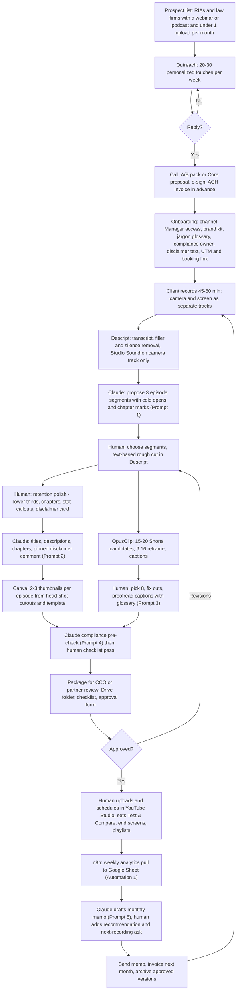

## TL;DR

- Unit of work is one client-month: 1 recording (45-60 min, camera + screen as separate tracks) becomes 3 episodes, 8 Shorts, 3 titles + 2-3 thumbnails per episode, descriptions/chapters, a compliance package and a memo. Corrected human time **16-22 h**; automation **25-40%** of production time (execution skeptic), not the dossier's 58%.
- What is fully automatable today: transcription, filler/silence removal, clip candidates and captions, thumbnail templating, metadata first drafts, analytics pull and memo draft, invoicing. What is not: segment judgment, retention polish, caption proofreading of statute/form names, compliance pass, client approval loop, publishing (keep human-triggered for the audit trail).
- Stack at ~$125/mo (range $112-156, the same figures as [[reports/youtube-manager-expert-firms/report]] section 7.2): Descript Creator $35, OpusClip Pro $29, Canva Pro $18, Claude Pro $20, n8n $0 self-hosted or $24 Cloud Starter, $0-20 top-up allowance, ~$10 Stripe ACH fees at $1,600/mo billed. A $50 tier (Descript Hobbyist $24 + Claude Pro $20 + free OpusClip/Canva) delivers the A/B pack and one Core client; a $0 tier is only good for a single sub-60-minute test (Descript Free: 60 media minutes/mo, 720p watermarked exports).
- Automate in this order: (1) analytics pull to Sheet and memo draft (n8n + YouTube Analytics API + Claude), (2) the metadata and Shorts-package generator (Claude from transcript), (3) outreach personalization queue. Publishing, compliance and revisions stay manual by design.
- Two hard constraints: YouTube channel permissions do not grant API access, so the analytics automation needs each client's owner account to OAuth into your own Google Cloud project, and that project's consent screen must be set to "In production" before the client authorizes, because an app left in "Testing" has every refresh token revoked after 7 days ([Google Cloud Help](https://support.google.com/cloud/answer/15549945?hl=en); [Unipile, 2026](https://www.unipile.com/google-oauth-refresh-token/)); in production while unverified you get the "unverified app" warning and a 100-user cap, both fine at this scale. Descript meters media minutes with no rollover, so upload one clean master per recording, not every re-export.
- QA gate before anything reaches the client: no AI avatar/voice, no synthesized likeness, no "guaranteed/best/#1", no performance claims, no testimonials, disclaimer on screen + description + pinned comment, "Attorney Advertising" where required, every statute/form/name spelled correctly in captions, AI-disclosure toggle deliberately set to No with a note.
- Six copy-paste prompts below cover segmentation, packaging, Shorts hooks + caption proof, compliance pre-check, the monthly memo and outreach personalization. Companion notes: [[reports/youtube-manager-expert-firms/report]], [[reports/youtube-manager-expert-firms/plan]].

## 1. End-to-end workflow



## 2. Step table

Times are per client-month at the skeptic-corrected pace (execution skeptic: long-form 7-10 h, Shorts 3-4 h, packaging 2 h, compliance + revisions 2-3 h, upload + memo 2-3 h).

| # | Step | Who / what | Automation level | Tool + monthly cost | Time per unit | Quality gate |
|---|---|---|---|---|---|---|
| 1 | Prospect list build | n8n or manual search + Claude qualification | assisted | YouTube search, LinkedIn, SEC IAPD (free); Claude Pro $20; n8n $0-24 | 1.5 h/mo (overhead) | Fit rule: SEC/state RIA or non-filing-state law firm, has recordings, <1 upload/mo, no BD affiliation |
| 2 | Outreach drafting and sending | Claude drafts, human personalizes and sends | assisted | Gmail (free), optional Instantly free tier; Prompt 6 | 3-4 h/wk during ramp | One specific observation about their last video per message; CAN-SPAM footer; no mass sends from primary domain |
| 3 | Call, proposal, contract, invoice | Human | manual | Google Meet, Claude-drafted proposal, Dropbox Sign free tier, Stripe ACH (0.8% capped $5) | 2 h per close | Scope, revision cap, approval clause, assignment clause in writing |
| 4 | Onboarding | Human with Claude-generated questionnaire | assisted | Google Forms + Drive (free) | 1-1.5 h per client | Compliance owner named; disclaimer text received; glossary of 30+ terms; UTM + booking link live; channel access via Manager role, never a password |
| 5 | Ingest, transcript, cleanup | Descript | full | Descript Creator $35 (30 media hours/mo, 800 AI credits) | 15-20 min hands-on | Check proper nouns against glossary; Studio Sound only on camera track; keep breaths (do not strip all fillers) |
| 6 | Segment selection | Claude proposes, human decides | assisted | Claude Pro; Prompt 1 | 1 h | Each episode answers one searchable question; cold open within 15 s; no mid-thought starts |
| 7 | Rough cut | Descript text-based edit | assisted | Descript | 2-3 h | Natural cadence for a professional audience; no jump-cut every 2 s |
| 8 | Retention polish | Human in Descript or CapCut | manual | Descript / CapCut free; Canva assets | 4-6 h | Chapters on screen, lower thirds, 3-5 stat callouts, disclaimer card at open and close |
| 9 | Shorts | OpusClip candidates, human fix pass | assisted | OpusClip Pro $29 (300 credits; 1 credit per source minute) | 3-4 h | Expect ~40% of candidates to need rework; re-crop slide-heavy segments to square; hook line in first 2 s; captions proofread |
| 10 | Thumbnails | Canva templates + human composition | assisted | Canva Pro $18 | 1.5 h | Client's real face only; 3-5 words; brand colors; no AI-generated likeness; contrast check at 120 px |
| 11 | Titles, descriptions, chapters, tags, pinned comment | Claude drafts, human edits | assisted | Claude Pro; Prompt 2 | 45 min | No "guaranteed/best/#1", no performance claims, disclaimer + UTM in every description |
| 12 | Compliance pre-check and package | Claude pre-check, human checklist | assisted then manual | Claude Prompt 4; Drive folder; approval form | 1-1.5 h | Section 5 checklist fully ticked; approval form sent to named owner |
| 13 | Client review and revisions | Human | manual | Frame.io free or Drive comments; Loom free | 1-2 h (2 rounds) | Consolidated feedback; extra rounds billed at $200-250 |
| 14 | Upload, schedule, Test & Compare, end screens, playlists | Human in YouTube Studio (deliberately not API) | manual | YouTube Studio (free) | 1 h | Advanced Features enabled; up to 3 variants; 2-week test; publish only after written approval; AI-disclosure toggle reviewed |
| 15 | Analytics pull | n8n | full | n8n $0-24; YouTube Analytics API (free quota) | 5 min/mo after setup | OAuth app "In production" before the client authorizes (Testing-mode tokens die after 7 days); Sheet updates weekly; CTR, AVD, impressions, traffic sources, UTM clicks; monthly manual CSV export from Studio as the fallback |
| 16 | Monthly memo | Claude drafts, human adds recommendation | assisted | Claude Pro; Prompt 5 | 45 min | Three numbers, one recommendation, one ask; never vanity-only |
| 17 | Invoicing | Stripe recurring ACH invoice | full | Stripe (0.8% capped $5) | 5 min/mo | Billed in advance; failed ACH ($4) retried once then card |

Totals per client-month: 16-22 h human, of which about 4-6 h is machine-assisted first-draft work the human only reviews. Automation share by time relative to a 28-30 h manual baseline: ~25-40%.

## 3. Recommended stacks by budget

| Tier | Tools (exact names, prices) | Monthly | What it unlocks | What it cannot do |
|---|---|---|---|---|
| **Free ($0)** | Descript Free (60 media minutes/mo, 100 one-time AI credits, 720p watermarked exports; [Castmagic, 2026](https://www.castmagic.io/blog/descript-pricing), [fluxnote, 2026](https://fluxnote.io/guides/descript-pricing-2026)), OpusClip Free (60 credits, watermark; [eesel](https://www.eesel.ai/blog/opusclip-pricing)), CapCut desktop free, Canva Free, Claude free tier, YouTube Studio (Test & Compare, Inspiration tab, Analytics), Google Sheets/Forms/Drive, n8n self-hosted on an existing machine, Wave invoicing, Dropbox Sign free | $0 | One sub-60-minute workflow test, the A/B pack (thumbnails in Canva Free, native Test & Compare), analytics by hand | Cannot hold the two 45-60 min portfolio webinars (90-120 media minutes against a 60-minute cap) and exports are watermarked, so the portfolio needs Hobbyist; watermarked Shorts; Claude free limits on long transcripts |
| **About $50** | Descript Hobbyist $24 monthly (10 media hours, 400 AI credits, no watermark; [Sonix](https://sonix.ai/resources/descript-pricing/), [fluxnote](https://fluxnote.io/guides/descript-pricing-2026)); Claude Pro $20 ([SSD Nodes](https://www.ssdnodes.com/learn/claude-pro-price-and-limits)); OpusClip Free or Starter $15 (150 credits; [Creatify](https://creatify.ai/blog/opusclip-pricing-plans-and-what-you-ll-actually-pay-in-2026)); Canva Free; n8n self-hosted; Stripe | $44-59 | The two-webinar portfolio (month 0), one Core client end to end, A/B packs, all six prompts | No scheduler or multi-aspect in OpusClip Free; Hobbyist media minutes may not cover re-uploads; Canva Free lacks background remover (use Descript green screen or free removers) |
| **About $150** | Descript Creator $35 (30 media hours, 800 AI credits, top-ups allowed); OpusClip Pro $29 (300 credits, scheduler, multi-aspect); Canva Pro $18 ([usecarly](https://www.usecarly.com/blog/canva-pricing/)); Claude Pro $20; n8n Cloud Starter $24 (2,500 executions; [No Code MBA](https://www.nocode.mba/articles/n8n-pricing)) or self-hosted $0; $0-20 Descript top-up allowance; ~$10 Stripe ACH fees | $112-156 (working midpoint $125; self-hosted n8n with no top-ups = $112, Cloud Starter plus $20 top-ups = $156) | Two clients at Plus scope, LinkedIn cutdowns, automated analytics and memo drafts, 4K exports | Still 16-22 h/client of human time; a third client needs 15-19 h/wk |

Links: [Descript pricing](https://www.descript.com/pricing), [OpusClip pricing](https://www.opus.pro/pricing), [Canva pricing](https://www.canva.com/pricing/), [Claude pricing](https://claude.com/pricing), [n8n pricing](https://n8n.io/pricing/), [Stripe pricing](https://stripe.com/pricing). Vendor pages were not fetchable this session; prices above come from the 2026 third-party guides cited in [[reports/youtube-manager-expert-firms/report]] and should be confirmed at checkout.

## 4. Copy-paste prompts

### Prompt 1: Segment a recording into episodes

```
You are an editor for a YouTube channel run by a licensed [financial advisor | attorney | CPA]. The audience is prospective clients researching a specific problem, not other professionals. Tone: calm, precise, no hype.

Below is a timestamped transcript of a 45-60 minute recording. Propose exactly 3 stand-alone episodes of 8-15 minutes each.

For each episode return:
1. Working title phrased as the question a viewer would type into YouTube search.
2. Start and end timestamps of every transcript span to include (spans may be non-contiguous; list them in playback order).
3. A cold open: the single 10-15 second span, quoted verbatim from the transcript, that states the payoff or the mistake to avoid. Do not write new words for the speaker.
4. 4-6 chapter titles with timestamps relative to the new episode.
5. Any sentence that makes a promise, cites a number, or names a rule, statute, form or product, quoted verbatim, so a human can verify it before publishing.
6. Any span that should be cut because it references a specific client, uses "guaranteed", "best", "#1", or compares performance to a benchmark.

Rules: never start an episode mid-sentence; prefer segments that answer one question completely; do not merge topics; if fewer than 3 clean episodes exist, say so and propose 2.

Transcript:
[PASTE TRANSCRIPT WITH TIMESTAMPS]
```

### Prompt 2: Titles, descriptions, chapters, pinned comment

```
You write metadata for a YouTube channel owned by a licensed [advisor | attorney | CPA] in [STATE]. Compliance constraints you must obey: no words "guaranteed", "guarantee", "best", "#1", "top-rated", "risk-free", "beat the market"; no performance figures or return promises; no client testimonials; no urgency language ("act now"); no statement that the video is legal, tax or investment advice for the viewer.

Episode summary and chapter list:
[PASTE FROM PROMPT 1 OUTPUT]

Return:
A. 3 title options, each under 60 characters, each a specific question or numbered mistake (e.g. "Roth conversion after 65: 3 rules that change the math"). No clickbait words listed above.
B. A description of 120-180 words: first line restates the question; second paragraph what the viewer will learn; third paragraph a plain call to action using this exact link with UTM: [BOOKING_URL]?utm_source=youtube&utm_medium=video&utm_campaign=[EPISODE_SLUG]
C. Chapter list formatted as "00:00 Chapter title", starting at 00:00.
D. 10 tags, lower case, comma-separated, no brand names other than the firm's.
E. A pinned comment: one sentence inviting a question, then this exact disclaimer text verbatim: "[CLIENT_DISCLAIMER_TEXT]"
F. For attorneys only: prepend "Attorney Advertising." to the description if [STATE] requires labeling.
```

### Prompt 3: Shorts hooks and caption proofreading

```
You are proofreading captions for 9:16 Shorts cut from a video by a licensed [advisor | attorney | CPA]. Errors in statute numbers, form names, dollar thresholds or proper nouns destroy credibility with this audience.

Glossary of correct spellings and figures for this client:
[PASTE GLOSSARY: e.g. "IRS Form 8606", "Section 1031", "RMD", "SECURE 2.0 Act", "Roth IRA", client name, firm name, city]

For each Short below (auto-generated caption text with timestamps):
1. Return the corrected caption text, changing only errors, not phrasing.
2. List every correction you made as "was -> now".
3. Flag any figure or rule you could not verify against the glossary with "VERIFY:".
4. Write a 6-9 word on-screen hook line for the first 2 seconds that states the payoff without any word from this banned list: guaranteed, best, #1, secret, hack, risk-free.
5. Rate the clip START: "clean" if it begins on a complete sentence, "mid-thought" if not.

Shorts:
[PASTE OPUSCLIP CAPTION EXPORTS]
```

### Prompt 4: Compliance pre-check

```
Act as a marketing-compliance reviewer for a [SEC-registered investment adviser under Rule 206(4)-1 | law firm under ABA Model Rules 7.1 and 7.2 and [STATE] bar advertising rules | CPA firm]. You are not the final approver; you produce a flag list for the firm's compliance owner.

Review the episode transcript, titles, description, thumbnail text and pinned comment below. Return a table with columns: Item | Location (timestamp or field) | Quoted text | Rule concern | Suggested fix.

Check for:
- Performance claims, projected returns, hypothetical results without disclosures
- Testimonials or endorsements, including implied ones ("my clients love...")
- "Guaranteed", "best", "#1", "top", "risk-free", "no-lose", superlatives
- Advice framed as personal to the viewer instead of educational
- Missing disclaimer (educational only; not advice; consult your own professional)
- Missing "Attorney Advertising" label where required; any statement of specialization or certification not held
- Named clients, case details, or identifiable third parties
- Fee or cost statements without "fees vary" context
- Anything an AI persona could not say: confirm the speaker is the licensed human throughout

End with: "READY FOR HUMAN REVIEW" or "BLOCKING ISSUES: n".

Materials:
[PASTE TRANSCRIPT, TITLES, DESCRIPTION, THUMBNAIL TEXT, PINNED COMMENT]
```

### Prompt 5: Monthly memo

```
Write a one-page monthly memo for [FIRM] from their YouTube channel operator. Reader is a partner or advisor who will spend two minutes on it. Plain English, no emojis, no marketing tone.

Data (CSV from YouTube Analytics and the UTM sheet, this month vs last month):
[PASTE CSV: video, publish date, impressions, CTR, views, average view duration, average percentage viewed, watch hours, subscribers gained, traffic source split, UTM clicks, bookings attributed]

Structure exactly:
1. Three numbers that matter (each one line): the attributable number first (UTM clicks or bookings), then watch time, then the best CTR with the Test & Compare winner named. Give the change vs last month.
2. What worked (2-3 sentences, cite the specific video and why, e.g. search-driven title).
3. What did not (1-2 sentences, honest).
4. One recommendation for next month (one sentence, specific: topic, format, or packaging change).
5. One ask for the next recording: the single question the client should answer on camera, phrased as the viewer would search it.
Do not report subscriber counts as the headline. Do not use the words "viral", "explode" or "skyrocket".
```

### Prompt 6: Outreach personalization

```
Draft a first-touch cold email to [NAME], [ROLE] at [FIRM], a [fee-only RIA in STATE | estate-planning law firm in STATE]. I have watched their most recent YouTube upload: "[VIDEO TITLE]" published [DATE], [VIEWS] views, uploaded [N] months after the previous one.

Constraints: under 110 words; no flattery; no "I hope this finds you well"; one specific observation about that video (a title/thumbnail issue, a strong moment that should be a Short, or the gap between uploads); one concrete offer: a $[150-300] title-and-thumbnail test on that video using YouTube's built-in Test & Compare, results in two weeks, nothing published without their approval; one question to end. Mention in one clause that everything goes through their compliance review. Plain text, no links except a single Loom link placeholder [LOOM]. Subject line under 6 words, no clickbait.

Also produce a 40-word LinkedIn connection note version and a 3-line follow-up for day 5 that adds one new observation rather than "bumping".
```

## 5. QA checklist (before anything reaches the client or YouTube)

Content and AI-policy
- [ ] The only person speaking or appearing is the licensed client (no AI avatar, AI voice, dubbed or cloned voice; YouTube's Jul 2026 clarification demonetizes AI-persona expert content)
- [ ] No synthesized or altered likeness anywhere, including thumbnails; AI backgrounds are non-photoreal only
- [ ] "Altered or synthetic content" toggle set to No, with a one-line note in the package explaining why (editing, captions and thumbnails are production assistance)
- [ ] Each episode has original human framing (cold open, chapters, callouts); no templated, repeated intro across episodes beyond a 3-second brand card
- [ ] Shorts are not exact duplicates of clips posted to TikTok/Meta (edit variants for other platforms to avoid unoriginal-content demotion)

Accuracy
- [ ] Every statute, form number, dollar threshold, date and proper noun in captions and on-screen text checked against the glossary
- [ ] Every number spoken on camera listed in the package for the client to verify
- [ ] No mid-thought starts on any Short; hook line visible within 2 seconds

Compliance (RIA)
- [ ] No performance claims, projections or hypotheticals without required disclosures; no testimonials or endorsements; no "guaranteed/best/#1"
- [ ] Disclaimer on screen (open and close), in description, in pinned comment
- [ ] Approval form sent to the named compliance owner; nothing scheduled until written sign-off; approved versions archived with date and approver (Marketing Rule books-and-records support)

Compliance (law)
- [ ] "Attorney Advertising" label where the state requires it (on screen, description, embed page)
- [ ] No claims of specialization or certification not held; no case-outcome promises; no identifiable client matters
- [ ] Filing-state check done (FL: $250 timely / $750 late per ad from 1 Jul 2026; TX: file within 10 days); educational exemption confirmed in writing or filing cost quoted as pass-through

Packaging and publishing
- [ ] Thumbnails 1280x720, readable at 120 px, real face, 3-5 words
- [ ] Test & Compare set with up to 3 variants; Advanced Features enabled; two-week window noted in the calendar
- [ ] Description contains UTM booking link; chapters start at 00:00; end screens and playlist set
- [ ] Raw files, transcript, approved exports in the client's Drive folder; raw deleted 90 days after approval per contract

## 6. Automation roadmap

**Month 1 (run by hand):** everything. Use the six prompts in Claude Pro projects (one project per client with the glossary, disclaimer and brand notes as project knowledge). Pull analytics by exporting CSV from YouTube Studio. Track outreach in a Google Sheet. Reason: the workflow's judgment steps are not yet known well enough to specify.

**Months 2-3 (automate):**
1. Analytics pull + memo draft (below).
2. Metadata and Shorts package generator (below).
3. Outreach queue: n8n reads a Sheet of qualified prospects, calls the Claude API with Prompt 6 and the prospect row, writes the draft back to the Sheet for human send; never auto-sends.
4. Invoice reminders: Stripe recurring ACH invoices with a 3-day-before reminder; n8n posts unpaid invoices to a daily digest.
5. Approval tracker: Google Form response from the compliance owner triggers an n8n workflow that moves the package folder to "Approved", timestamps the approval in a log Sheet, and sends the operator a "safe to schedule" message.

### Automation 1: Weekly analytics pull and monthly memo draft

- **Trigger:** n8n Schedule node, Mondays 06:00 local; a second schedule on the 1st of the month for the memo draft.
- **Prerequisite (client-facing):** the channel owner (not a delegate) authorizes the operator's Google Cloud OAuth app once; channel permissions do not grant API access ([YouTube Help](https://support.google.com/youtube/answer/9367690?hl=en)).
- **Prerequisite (operator-side, blocking):** set the OAuth consent screen to **In production** before the client authorizes. An app left in "Testing" with external users has every refresh token revoked after 7 days, so a weekly Monday pull would fail every second week and the owner would have to re-consent each time ([Google Cloud Help: Manage app audience](https://support.google.com/cloud/answer/15549945?hl=en); [Unipile, 2026](https://www.unipile.com/google-oauth-refresh-token/)). Publishing requires an app name, support email, homepage URL and privacy-policy URL on the consent screen; put both pages on the one-page site. Request only the `youtube.readonly` and `yt-analytics.readonly` scopes. While in production and unverified, the client sees an "unverified app" warning and the app is capped at 100 users; Google verification is not needed under 100 users, so accept both, disclose them in onboarding (question 11 in [[reports/youtube-manager-expert-firms/plan]]), and walk the owner through the "Advanced > Go to app" click on the warning screen.
- **Inputs:** channel ID, list of video IDs published in the last 90 days, date range, UTM click data from the booking page (Google Sheet fed by the client's booking tool or a Bitly export).
- **Steps:** (1) YouTube Analytics API `reports.query` for views, estimatedMinutesWatched, averageViewDuration, averageViewPercentage, subscribersGained, per video and per traffic source; (2) YouTube Data API `videos.list` for titles and publish dates; (3) append rows to the client's Sheet tab "weekly"; (4) on the monthly run, compute month-over-month deltas in a Code node; (5) call the Claude API with Prompt 5 and the CSV; (6) write the draft to a Google Doc in the client folder and message the operator.
- **Outputs:** updated Sheet, a Doc titled "[Firm] YouTube memo [YYYY-MM] DRAFT".
- **Failure handling:** refresh token revoked or expired (`invalid_grant`) sends an alert with the re-auth link and a one-line note on the likely cause (app still in Testing, owner changed password or revoked access); quota exceeded retries after 1 hour up to 3 times; missing UTM sheet produces the memo with an "attribution data missing" line rather than silently omitting it; the memo is never sent to the client by the workflow.
- **Fallback (so the memo never depends on the OAuth link):** on the 1st of the month, if the Sheet has no rows dated in the last 10 days, the operator exports the analytics CSV by hand from YouTube Studio (the Manager role can view and export Analytics) and drops it in the client folder; Prompt 5 runs on that CSV instead. Keep this as the month-1 default and as the permanent backstop.
- **Cost:** n8n self-hosted $0 or Cloud Starter (well under 2,500 executions); Claude API a few cents per memo; YouTube API free quota.

### Automation 2: Metadata and Shorts package generator

- **Trigger:** a new transcript file (.txt or .srt) lands in the client's "02_transcripts" Drive folder (n8n Google Drive trigger, polling every 15 min).
- **Inputs:** transcript with timestamps; client config JSON (vertical, state, disclaimer text, booking URL, glossary, banned words); optional OpusClip caption export in "03_shorts_captions".
- **Steps:** (1) read transcript; (2) Claude API call with Prompt 1 to produce segment proposals; (3) for each proposed episode, Claude API call with Prompt 2 for titles, description, chapters, tags, pinned comment; (4) if caption exports exist, Claude API call with Prompt 3 per Short; (5) Claude API call with Prompt 4 on the assembled package; (6) write one Google Doc per episode plus a "package_review.md" summary listing every VERIFY and BLOCKING item; (7) notify the operator.
- **Outputs:** Docs in "04_package_draft"; a review summary; nothing is uploaded to YouTube.
- **Failure handling:** transcripts over the model context are chunked by 15-minute spans and merged; a banned word surviving in any title fails the run and marks the Doc "BLOCKED"; Claude API errors retry twice then leave a "manual run needed" file; the Drive trigger de-duplicates by file ID so a re-uploaded transcript does not re-run silently.
- **Cost:** Claude API well under $1 per client-month at current token prices (assumption; confirm current API token prices on claude.com before wiring); n8n executions ~10 per recording.

## 7. Metrics to log and how

| Metric | Where | Frequency | Why |
|---|---|---|---|
| Touches sent, replies, meetings, proposals, closes (by vertical) | Outreach Sheet | Daily | Drives the 30/60/90 gates in [[reports/youtube-manager-expert-firms/plan]] |
| Hours per client-month by step (log in 15-minute blocks) | Time Sheet (Toggl free or a Sheet) | Every session | The gate that decides whether the economics work (target 16-22, then under 16) |
| Descript media minutes and AI credits used; OpusClip credits used | Tool dashboards, copied monthly | Monthly | Avoid top-ups; decides annual-plan timing |
| Per video: impressions, CTR, AVD, average % viewed, watch hours, traffic sources | Automation 1 Sheet | Weekly | Memo inputs; Test & Compare readouts |
| Test & Compare outcomes (winner, CTR delta, or inconclusive) | Sheet tab "tests" | Per test | Proof for the A/B pack and the price step |
| UTM clicks and booked consultations | Booking tool export to Sheet | Weekly | The only number the client renews on |
| Approval cycle time (package sent to approval received) | Approval log Sheet | Per batch | Flags "too cumbersome" churn early; sets the SLA |
| Revision rounds per batch | Approval log | Per batch | Bill the third round; identify unclear briefs |
| Revenue, tool cost, effective hourly | Finance Sheet | Monthly | Report against the scenarios in [[reports/youtube-manager-expert-firms/report]] |

## Sources

- [YouTube Help: Channel permissions do not provide API access](https://support.google.com/youtube/answer/9367690?hl=en)
- [Google Cloud Help: Manage app audience (Testing vs In production; 7-day token expiry; 100-user cap)](https://support.google.com/cloud/answer/15549945?hl=en)
- [Unipile: Google OAuth refresh token expiration, 7-day limit and lifetime explained (2026)](https://www.unipile.com/google-oauth-refresh-token/)
- [YouTube Help: Get access to intermediate and advanced features](https://support.google.com/youtube/answer/9891124?hl=en)
- [YouTube Help: A/B test titles and thumbnails](https://support.google.com/youtube/answer/16391400?hl=en-GB)
- [YouTube Help: Explore Inspiration tab](https://support.google.com/youtube/answer/15575509?hl=en)
- [TechCrunch: YouTube clarifies policies around AI slop (20 Jul 2026)](https://techcrunch.com/2026/07/20/youtube-clarifies-policies-around-ai-slop-and-upsetting-videos/)
- [minimatters: YouTube altered or synthetic content disclosure policy 2026](https://minimatters.com/youtube-altered-or-synthetic-content-disclosure/)
- [Sonix: Descript pricing 2026 (Creator $35, 30 media hours, 800 AI credits)](https://sonix.ai/resources/descript-pricing/)
- [Shade: Descript pricing 2026, media minutes and top-ups](https://shade.inc/blog/descript-pricing)
- [Castmagic: Descript pricing 2026, free plan limits (60 media minutes, watermarked)](https://www.castmagic.io/blog/descript-pricing)
- [fluxnote: Descript pricing 2026 (Hobbyist $24, 10 media hours, 400 AI credits)](https://fluxnote.io/guides/descript-pricing-2026)
- [Creatify: OpusClip pricing 2026 (Pro $29, 300 credits)](https://creatify.ai/blog/opusclip-pricing-plans-and-what-you-ll-actually-pay-in-2026)
- [eesel: OpusClip pricing 2026 (Free 60 credits, Starter 150)](https://www.eesel.ai/blog/opusclip-pricing)
- [usecarly: Canva pricing 2026 (Pro $18)](https://www.usecarly.com/blog/canva-pricing/)
- [SSD Nodes: Claude Pro price and limits (Aug 2026)](https://www.ssdnodes.com/learn/claude-pro-price-and-limits)
- [No Code MBA: n8n pricing 2026 (Cloud Starter $24, 2,500 executions)](https://www.nocode.mba/articles/n8n-pricing)
- [FeeCalcPro: Stripe ACH fees 2026 (0.8% capped at $5)](https://www.feecalcpro.com/blog/stripe-ach-guide/)
- [The Florida Bar: Advertising regulation and fees from 1 Jul 2026](https://www.floridabar.org/ethics/etad/)
- [Improvado: FINRA 2210 compliance guide 2026](https://improvado.io/blog/finra-2210)
- [Smarsh: SEC Marketing Rule FAQs 2026](https://www.smarsh.com/blog/thought-leadership/sec-marketing-rule-faqs-2026-compliance-guidance/)
- Execution benchmarks (editing minutes per finished minute, OpusClip rework rates, Descript accuracy) as relayed in [[research/candidates/youtube-manager-expert-firms-skeptic-execution]]
- Vault: [[research/candidates/youtube-manager-expert-firms]], [[decisions/final-selection]], [[reports/youtube-manager-expert-firms/report]], [[reports/youtube-manager-expert-firms/plan]]
